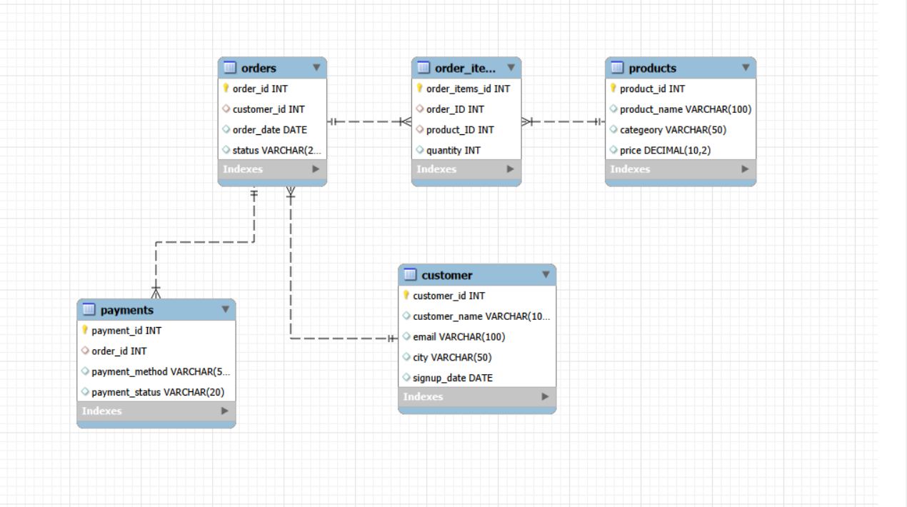

# E-Commerce Sales & Customer Analytics (SQL)

## 📌 Project Overview
This project analyzes an e-commerce database to uncover insights related to sales performance, customer behavior, and product trends using SQL.

## 🛠 Tools Used
- MySQL
- SQL (Joins, Subqueries, CTEs, Aggregations)
- MySQL Workbench

## 🗄️ Database Schema

## 📊 Key Analysis
- Monthly revenue trends
- Top-selling products
- Customer lifetime value (CLV)
- Repeat customer analysis
- Category-wise performance
- Payment success rate

## 📈 Business Insights
- Repeat customers generate higher average order value
- Electronics category contributes the highest revenue
- Over 20% of customers contribute nearly 60% of total revenue

## 📂 Files Description
| File | Description |
|-----|------------|
| schema.sql | Database and table creation |
| insert_data.sql | Dummy dataset (90+ rows) |
| analysis_queries.sql | All SQL analysis queries |
| insights.md | Business findings and conclusions |

## 🚀 How to Run
1. Run `schema.sql`
2. Run `insert_data.sql`
3. Execute queries from `analysis_queries.sql`

## 📌 Author
Rushil Khare
